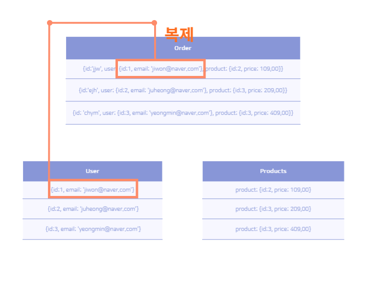

# SQL vs NoSQL ⚽

## SQL (관계형DB) 📋

SQL DB는 Relational Database Management System(RDBMS)를 기반으로 하는 데이터베이스이다. 데이터는 구조화되어 테이블 형태로 저장되며, 데이터 간의 관계를 정의하여 쉽게 검색, 수정, 삭제할 수 있다.
SQL은 대용량 데이터 처리에 매우 효율적이며, 대부분 ACID(Atomicity, Consistency, Isolation, Durability) 특성을 갖추고 있어 데이터의 일관성과 무결성, 데이터 처리의 안정성을 보장한다.
SQL의 핵심 특성은 데이터 스키마를 지니고 있어 각각의 테이블마다 데이터의 형태, 종류를 분명하게 정의하며, 일대일 일대다 또는 다대다라는 상관관계들로 테이블들이 연결되어 있다.
또한 테이블 설계 시 데이터의 중복을 제거할 수 있는 정규화가 가능하다. 

### Sql의 장단점 🖋

#### 장점 📌

- 데이터의 일관성과 무결성을 보장
- 대용량 데이터 처리에 효율적
- 정규화로 각 데이터의 중복 제거

#### 단점 📌

- 유연성이 떨어지며, 새로운 데이터 스키마를 추가하려면 데이터베이스 스키마를 변경
- 분산 처리에 적합하지 않음
- 대용량 데이터 처리에 한계

## NoSQL (비관계형DB) 📋

NoSql은 Sql과 달리 관계형 데이터베이스가 아닌, 비관계형 데이터베이스로 분류되며, 데이터는 테이블 형태로 저장되는 것이 아닌, Key-Value, Document, Column-Family 등의 형태로 저장된다.
상관 관계가 존재하지 않는 대신 데이터를 복제하게 되는데, 해당 집합에 필요한 데이터를 복제하여 각각 작동하는 문서들의 집합을 보유한다. 
만약 데이터가 변경된다면 복제한 곳에서 모두 업데이트가 되어야 한다. 하지만 해당 데이터의 조회를 위해 다수의 테이블을 JOIN하는 것이 아니라, 집합 하나만 조회하기 때문에 복잡하고 긴 쿼리를 작성할 필요가 없어 성능에 영향을 미치지 않는다. ( ex. 주문 페이지에는 주문 집합의 데이터들만 조회하기 때문에 매우 빠르다!!)
NoSql은 분산 처리에 적합하며, 대용량 데이터 처리에 높은 성능을 보인다. 
또한, NoSql은 강한 데이터 스키마가 없고 유연한 스키마를 사용하므로 데이터 처리의 유연성이 높다. 하지만, 데이터의 일관성과 무결성을 보장하지 않으며, ACID 특성을 갖추지 않는다.

### NoSql의 장단점 🖋

#### 장점 📌

- 분산 처리에 적합
- 대용량 데이터 처리에 높은 성능
- 유연한 스키마를 사용하므로 데이터 처리의 유연성이 높음

#### 단점 📌

- 데이터의 일관성과 무결성을 보장하지 않는다.
- ACID 특성을 갖추지 않는 경우가 많음

# 결론 🎯

## Sql과 NoSql의 선택

Sql과 NoSql은 각각 장단점이 있으며, 데이터 처리의 목적과 필요성에 따라 선택된다. 예를 들어, 데이터의 일관성과 무결성이 중요한 경우에는 Sql을 선택하는 것이 적절하며, 대용량 데이터 처리와 유연한 스키마가 필요한 경우에는 NoSql을 선택하는 것이 적합할 것이다.
따라서, 해당 프로젝트는 대용량의 공공 데이터 처리와 DB의 설계가 계속 바뀌게 될 우려로 인해 NoSQL을 선택했다.
