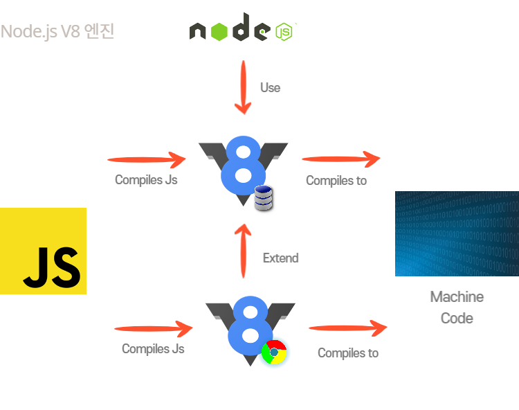
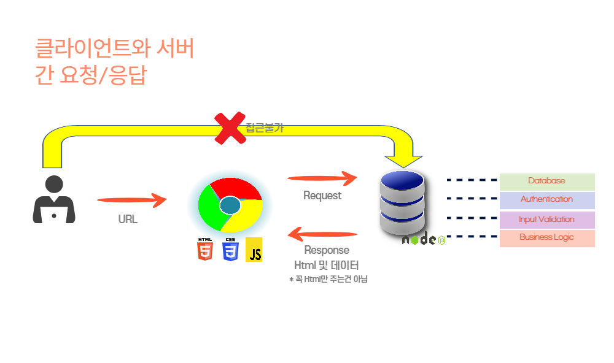

create node file

자바스크립트를 기본으로 만들어졌으며. 몇몇 기능을 더하고 브라우저에서 가능했던 몇몇 기능들이 빠진 다른환경에 구현한 자바스크립트

자바스크립트 코드를 서버에서 실행할 수 있도록 해주며, 서버뿐 아니라 어떤기기에서도 실행 할수 있게해준다. 따라서 브라우저 밖에서도 실행이 가능하다.

Node.js에 엔진인 V8은 자바스크립트를 기계어로 컴파일 해준다. (브라우저에서도 같은 역할을 해줌..!)
V8은 C++으로 이루여져있다.

Node.js.는 로컬 파일 시스템 활용, 파일 열기, 파일 읽기, 파일 삭제 등 웹브라우저에서 불가능한 작업을 할 수 있다.

Node.js의 확장된 버전의 V8로 자바스크립트를 컴퓨터에서 실행할 수 있다.

일반 자바스크립트는 브라우저에서 실행 되지만, Node.js는 런타임에서 직접 실행된다.

Node.js는 javaScript 런타임으로, 브라우저가 없고 서버를 구축하지 않아도 javaScript를 실행할 수 있다...!
또한 Node.js는 유틸리티 스크립트나(파일을 읽고,쓰고 편집) 빌드 과정에(React, Vue, Angular) 사용되기도 한다.

Node.js는 서버에서 동작하는 코드만 작성하는게 아닌 서버 자체를 생성한다...!
Node.js의 가장 큰 매력 포인트는 바로 프론트엔드에서 서버사이드 그리고 빌드 툴까지 사용할 수 있는 javaScript를 사용한다는 점이다!!

내가 Node.js를 배우면서 느낀점은 웹을 만들때 여러가지 언어를 배워야 할 수 있지만, Node.js로 어플리케이션을 만든다면 javaScript 한가지 언어로 어플리케이션을 만들 수 있어 효율성과 생산성을 크게 증가시킬수 있어 대단하다고 생각된다.

하지만 단점도 분명히 존재할 것이다..

어플리케이션을 만들 때 사용하는 언어는 항상 상황과 장단점을 고려해서 신중하게 사용해야 되는 듯 싶다.....!

그럼에도 Node.js는 한가지 언어로 프론트, 백앤드를 구축할 수 있으니 내가 원하는 풀스택 개발자가 될 수 있는 가장 빠른길이 아닐까..? 생각한다!
